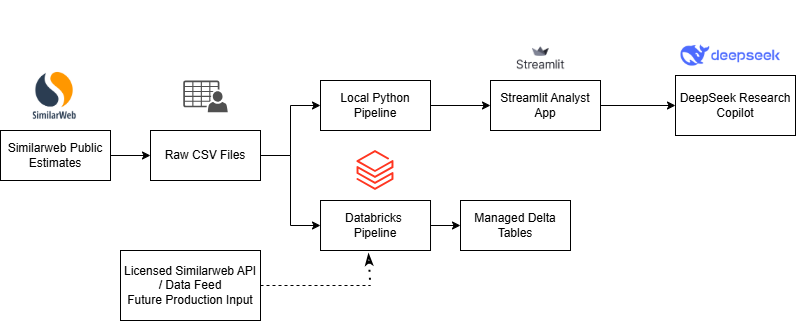

# Digital Opportunity Signal Engine

## Turning Similarweb estimates into a reusable research-prioritization product

This proof of concept demonstrates how digital intelligence can support company screening for a fictional growth-equity research team. It converts publicly visible Similarweb estimates into validated, peer-relative signals and serves the results through an interactive analyst application.

The proof of concept compares three consumer beauty brands with significant digital commerce activity: Rhode, Rare Beauty and Glossier. Their website traffic, engagement and acquisition signals are evaluated for July 2026 to demonstrate how external digital data can help prioritize companies for deeper commercial research. The resulting scores are research signals, not investment recommendations.

## Live Application

[Launch the Digital Opportunity Signal Engine](https://digital-opportunity-signal-engine.streamlit.app/)

Explore the peer comparison, adjust scoring assumptions and use the grounded AI Research Copilot to generate evidence-based diligence questions.

## Business problem

Company screening often relies on inconsistent spreadsheets and analyst judgment. This project creates a transparent workflow that helps a research team:

- Compare digital momentum, visitor engagement and traffic scale
- Identify which company deserves deeper research first
- Understand what drives each score
- Test alternative research priorities through adjustable weights
- Convert observed signals into structured diligence questions
- Trace every result back to its source and validation status

## Current result

Using the default scoring strategy, Rare Beauty ranks first because it is the only company in the peer set with positive monthly traffic momentum. Rhode leads in traffic scale and engagement depth, while Glossier sits between the two on momentum and scale.

The result is peer-relative and based on one observation month of public estimates. It should be used to organize a research queue, not to select an investment.

## Application features

### Executive Overview

- Current research priority
- Opportunity and confidence scores
- Ranked peer comparison
- Score-component analysis
- Plain-language result explanation

### Company Explorer

- Traffic and engagement metrics
- Country-level desktop traffic distribution
- Peer signal comparison
- Audience and acquisition context
- Help tooltips for unfamiliar metrics

### Scenario Simulator

- Adjustable momentum, engagement and traffic-scale weights
- Real-time score recalculation
- Scenario ranking and score-change comparison
- Reset to the default research strategy

### AI Research Copilot

- Explains a selected company's score
- Compares all three companies
- Generates prioritized diligence questions
- Accepts a custom business question
- Uses only the validated project data supplied by the application
- Separates observed evidence, hypotheses and recommended validation
- Does not calculate scores or provide investment advice

The optional copilot uses `deepseek-v4-flash` in non-thinking mode. API calls occur only after a user clicks the generation button. The app limits each browser session to ten requests and never stores the API key in source code.

### Data Trust

- Validation coverage and error counts
- Known limitations
- Source register
- Device-scope disclosure
- Scoring and confidence methodology

## Scoring methodology

The opportunity score combines three peer-relative components:

| Component | Default weight | Purpose |
|---|---:|---|
| Traffic momentum | 40% | Prioritizes recent growth or decline |
| Engagement depth | 35% | Combines pages per visit, visit duration and bounce rate |
| Traffic scale | 25% | Represents relative audience size |

Momentum receives the highest weight because the use case is designed to detect emerging digital signals rather than rank the largest website automatically. The weights are explicit assumptions and can be changed in the Scenario Simulator.

The confidence score reflects metric completeness, peer coverage, source type and available history. It does not claim that Similarweb estimates are 84% accurate.

## Data collection and ethical use

The POC uses publicly visible Similarweb estimates manually recorded on August 16, 2026. Manual collection was appropriate for validating a three-company concept without paid API access.

The project:

- Does not scrape Similarweb
- Does not bypass access controls
- Does not guess unavailable values
- Preserves missing values explicitly
- Records observation and collection dates separately
- Separates all-traffic engagement metrics from desktop-only geography and channel metrics

In production, the CSV input would be replaced with a licensed Similarweb API, Batch API or data feed while retaining the downstream validation and scoring layers.

## Architecture



### How the proof of concept works

1. Public Similarweb estimates are manually captured in three CSV files covering company observations, country traffic and audience demographics.

2. The local Python pipeline validates the inputs and calculates peer-relative momentum, engagement and traffic-scale scores.

3. The Streamlit application presents the results through the Executive Overview, Company Explorer, Scenario Simulator, AI Research Copilot and Data Trust views.

4. The DeepSeek Research Copilot receives only validated project context. It explains results and generates diligence questions, while the Python pipeline remains responsible for all calculations.

5. In parallel, the Databricks pipeline reads the same raw files from a managed volume, applies PySpark validation and scoring, and saves managed Delta tables.

### Production evolution

The dashed Similarweb API/Data Feed path represents a future licensed production input. It would replace manual CSV collection and feed the Databricks pipeline on a schedule.

The current Streamlit application reads from the local Python pipeline, not directly from the Databricks tables. The Databricks branch demonstrates how the workflow could scale into a production cloud environment.

## Databricks implementation

The Databricks Free Edition notebook:

- Reads all three raw CSV inputs from a managed volume
- Standardizes domain values
- Checks duplicate business keys
- Validates traffic shares, gender percentages and other ranges
- Stops table persistence when quality assertions fail
- Calculates the same peer-relative opportunity scores
- Saves four managed Delta tables:
  - `validated_observations`
  - `validated_country_traffic`
  - `validated_audience_demographics`
  - `opportunity_scores`

The notebook is available at `notebooks/databricks_poc.py`.

## Repository structure

```text
app/            Streamlit analyst application
architecture/   Production architecture materials
config/         Scoring weights and thresholds
data/raw/       Manually collected public estimates
data/processed/ Generated local pipeline outputs
docs/           Executive and client-facing materials
notebooks/      Databricks Free Edition implementation
sql/            DuckDB, Databricks and Snowflake examples
src/            Ingestion, validation, scoring and orchestration
tests/          Automated validation and scoring tests
```

## Local setup

Python 3.12 is recommended.

### Windows PowerShell

```powershell
py -3.12 -m venv .venv
.\.venv\Scripts\Activate.ps1
python -m pip install --upgrade pip
pip install -r requirements.txt
python -m src.pipeline
python -m pytest
python -m streamlit run app/streamlit_app.py
```

### macOS or Linux

```bash
python3.12 -m venv .venv
source .venv/bin/activate
python -m pip install --upgrade pip
pip install -r requirements.txt
python -m src.pipeline
python -m pytest
python -m streamlit run app/streamlit_app.py
```

## Optional DeepSeek setup

Create `.streamlit/secrets.toml` locally:

```toml
DEEPSEEK_API_KEY = "your-api-key"
```

The file is excluded through `.gitignore`. Never place the real key inside `streamlit_app.py`, the README, screenshots or GitHub.

For Streamlit Community Cloud, enter the same secret through the application's Secrets settings.

## Verification

Run the complete local verification sequence:

```powershell
python -m src.pipeline
python -m pytest
python -m py_compile app/streamlit_app.py
```

Current automated test result: `3 passed`.

## Production roadmap

A production implementation would add:

- Licensed and scheduled Similarweb delivery
- Additional companies and historical observations
- Peer groups defined by market, geography or investment strategy
- Orchestrated Databricks jobs and monitoring
- Centralized secrets and usage controls
- Authentication and role-based access
- Evaluation and logging for AI-generated interpretations
- First-party conversion, revenue and customer-acquisition data

## Disclaimer

Similarweb figures are third-party estimates and may differ from first-party analytics. This project demonstrates research prioritization and data-product design. It does not provide investment advice.
